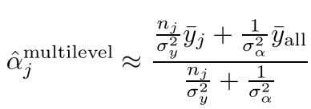
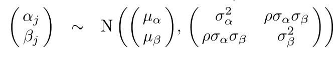
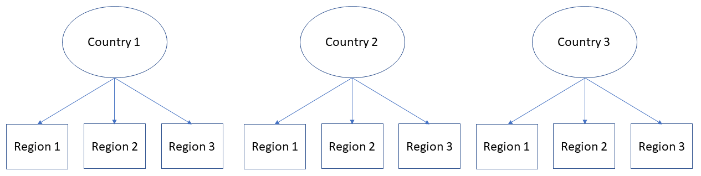
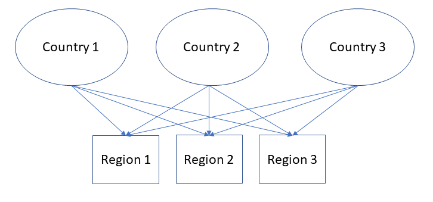
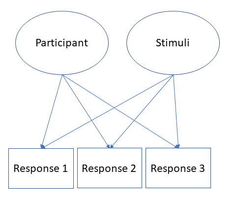

class: center, inverse
background-image: url("SumerianStand2.jpg")
background-size: contain
---

<style type="text/css">
body, td {
   font-size: 15px;
}
code.r{
  font-size: 15px;
}
pre {
  font-size: 20px
}
.huge .remark-code { /*Change made here*/
  font-size: 200% !important;
}
.tiny .remark-code { /*Change made here*/
  font-size: 80% !important;
}


</style>

## Press record

---

## Corrections from the previous lecture

---

## R code

[LINK](https://nvaci.github.io/Lecture_5_code/Lecture_5Rcode.html)

---

## Regression
.pull-left[
Gaussian distribution:
$y_{i} \sim \mathcal{N^{iid}}(\mu_{i},\sigma)$ <br/> <br/>
$\mu_{i} = \alpha+\beta*x_i$ <br/><br/> 
Model mean and standard deviation <br/> <br/> 
<br/>
<br/>
a) Errors: $\mathcal{N}^{iid}(0,\sigma^2)$ <br/> <br/>
b) Linearity and additivity <br/> <br/>
c) Validity <br/> <br/>
d) Lack of perfect multicolinearity <br/> <br/>
]
.pull-right[
We rarely have that: [Link](http://mfviz.com/hierarchical-models/)
]
---

## Correlated observations

Nested structures: observations nested hierarchically under general groups (eg. answers of pupils in the UK) <br/>
 - Pupils are nested in ther classes < schools < counties <br/> <br/>
 
Repeated measurements: observations clustered within the participants <br/> 
- Participants answering on a number of questions in an experiment <br/>
- NBA players contributing multiple observations of their performance throughout their career <br/><br/>

Clustering of the observations that are not nested: <br/>
- Questionnaire that collects profession of people and their country <br/> <br/>
---

## Multilevel models 

Generalization of regression $(y_i=\alpha+\beta*x_i+\epsilon_i)$, where we allow adjustments of: <br/><br/>
- Intercept: $y_i = \alpha_{j[i]}+\beta*x_i+\epsilon_i$ <br/><br/>
- Slope: $y_i=\alpha*\beta_{j[i]}*x_i+\epsilon_i$ <br/><br/>
- Both: $y_i=\alpha_{j[i]}*\beta_{j[i]}*x_i+\epsilon_i$

---

## Babies

```{r, echo=FALSE, warning=FALSE, message=FALSE}
set.seed(456)
#Fixed effects
alpha_0 <-400 #intercept
beta_1 <-20 #slope 
sigma <- 5 #sd

# by-intercept sd, by_slope sd and correlation between intercept and slope sd
tau_0 <- 50 # by-group random intercet (countries)

tau_1 <- 10 # by-group random slope (countries)
rho <- -.3

n_countries<-10

countries_rfx <- faux::rnorm_multi(
  n=n_countries,
  mu = 0,
  sd = c(tau_0, tau_1),
  r = rho,
  varnames = c('T_0s','T_1s')
)

babies_rfx=data.frame(T_0s=rep(countries_rfx$T_0s, each=20), T_1s=rep(countries_rfx$T_1s, each=20))

Babies <- data.frame(Country_id = rep(1:10, each=20),
babies_rfx)

Babies$Age=round(runif(200,1,30))
Babies$Weight=rnorm(200,4000,500)
Babies$Gender=rbinom(200,1,0.5)
Babies$Gender=as.factor(Babies$Gender)
levels(Babies$Gender)=c('Girls','Boys')
Babies$RunningDist=rnorm(200,alpha_0 + Babies$T_0s+(beta_1+Babies$T_1s)*Babies$Age, sigma)
Babies$Country_id=as.factor(Babies$Country_id)
```

```{r, warning=FALSE, message=FALSE}
knitr::kable(head(Babies), format = 'html')
```

```{r}
table(Babies$Country_id)
```
---

## Analysis of the data

1. Complete pooling - take into account all observations, without categorical information <br/><br/>
2. No pooling - adjust regression for each category  <br/> <br/>
3. Partial pooling - use categories to adjust individual estimates <br/> <br/>

---

## Complete pooling

Linear model where we ignore information about the countries: 

```{r}
mod1CP<-lm(RunningDist~Age, data=Babies)
summary(mod1CP)
```

```{css, echo=FALSE}
pre {
  max-height: 300px;
  overflow-y: auto;
}

pre[class] {
  max-height: 100px;
}
```

```{css, echo=FALSE}
.scroll-100 {
  max-height: 100px;
  overflow-y: auto;
  background-color: inherit;
}
```
---

## Complete pooling

Potential problems: 

```{r, fig.width=12, fig.height=5, fig.align='center'}
par(mfrow=c(1,1), bty='n',mar = c(5, 4, .1, .1), cex=1.1, pch=16)
plot(resid(mod1CP), ylab='Residuals', xlab='Index')
```

---

## No pooling

Linear model where we estimates parameters for each country separately:  

```{r}
mod1NP<-lm(RunningDist~Age+factor(Country_id)-1, data=Babies)
summary(mod1NP)
```

---

## No pooling

```{r, fig.width=12, fig.height=5, fig.align='center'}
par(mfrow=c(1,1), bty='n',mar = c(5, 4, .1, .1), cex=1.1, pch=16)
plot(resid(mod1NP), ylab='Residuals',xlab='Index')
```

---

## Trade-offs between the approaches

Complete pooling ignores variation between the categorical outcomes <br/> <br/>

No pooling can overfit the data within each group, especially in the case when there are few observations per group or extreme cases <br/> <br/>

---

## Partial pooling in multilevel model

No predictors situation: <br/> 

The goal is to estimate average running distance for all babies in country $j$, for which we have a random sample size of $n_j$ <br/> <br/>

Multilevel estimates for a given country $j$ can be approximated as a weighted average of the mean of observations in the country (the unpooled estimate, $y_j$) and the mean over all countries (completely pooled estimate $y_{all}$) <br/> <br/>


---

## Intercept

```{r, echo=FALSE, out.width = '40%',fig.align='center'}

```

$n_j$ - number of babies in a country <br/>
$\sigma^2_y$ - within country variance in running distance <br/>
$\sigma^2_\alpha$ - variance among the average running distance of the different countries <br/> <br/>

---

## Shrinkage estimator 

Averages from countries with smaller sample size cary less information, and the weighting pulls multilevel estimates closer to the overall average. <br/>
If the $n_j=0$ then overal average <br/><br/>

Averages from countries with larger sample size carry more information, and the multilevel estimates are close to the country averages. <br/>
If $n_j->\infty$ then country average <br/><br/>

Every other time, multilevel estimates are between the two extremes <br/>

---

## Multilevel model: intercept

$$y_i \sim N(\alpha_{j[i]}+\beta*x_i, \sigma^2_y)$$ 
<br/>
Soft constraint: $\alpha_j \sim N(\mu_\alpha, \sigma^2_\alpha)$ <br/><br/>

---

## Intercept adjustment: R

```{r, warning=FALSE, message=FALSE}
#install.packages('lme4')
require(lme4)

mult1<-lmer(RunningDist~Age+(1|Country_id), data=Babies)
summary(mult1)
```

---

## Results: intercept adjustment

$$y_i \sim N(\alpha_{j[i]}+12.08*x_i, 90.15)$$ 

<br/>
Soft constraint: $\alpha_j \sim N(381.01, 181.91)$ <br/><br/>

Variation between the countries versus within the country:<br/>
$\frac{\sigma^2_{\alpha}}{\sigma^2_y} = \frac{181.91}{90.15}=2$ <br/><br/>

Our variance between the countries is 2x larger (more informative) than variance within countries - our model will always benefit from inclusion of the random adjustments

---

## Multilevel model: intercept and slope adjustments 


$$y_i \sim N(\alpha_{j[i]}+\beta_{j[i]}*x_i, \sigma^2_y)$$ 
<br/>
Soft constraint: <br/>

```{r, echo=FALSE, out.width = '50%',fig.align='center'}

```

---

## Intercept and slope adjustments: R


```{r}
mult2<-lmer(RunningDist~Age+(1+Age|Country_id), data=Babies)
summary(mult2)
```

---

## Fixed effects

Many different definitions: [LINK](https://stats.stackexchange.com/questions/4700/what-is-the-difference-between-fixed-effect-random-effect-and-mixed-effect-mode) <br/>

```{r}
fixef(mult2)
```

---

## Random effects 

```{r}
ranef(mult2)
```

---

## Why multilevel modelling

- Helps us with better inference about fixed effects
- Interest in between group effects
- Better inferences about levels of group not included in the sample <br/><br/><br/>

- Deals better with the non-normality of outcomes
- Deals better with outliers (shrinks them towards the mean)
- Deals better with unequal number of observations per group

---

## When multilevel models = linear regression

Very little group-level variation - complete pooling <br/> <br/>

Too much group-level variation - no pooling <br/><br/>

We can build complete or no pooling model (next slide), but multilevel model automatically adjusts estimates for both groups, ones close to complete pooling and ones close to no pooling <br/><br/>  

???
How many groups/observations? - understanding partial pooling as a compromise between complete and no pooling indicates that the discussion about exact number of groups and observations is misguided. With few groups, we get classical regression - complete pooling and our multilevel model should be at least as good as linear regression. Having only two observations per group or even one observation in most of the groups might result in imprecise estimate of between group variance, but it should provide partial information that allows better estimation of parameters. 
---

## No pooling: 2

```{r}
mod1NP2<-lm(RunningDist~Age*factor(Country_id)-1, data=Babies)
summary(mod1NP2)[4]
```

---

## Residuals (no pooling versus multilevel model)

```{r, fig.width=12, fig.height=5, fig.align='center'}
par(mfrow=c(2,1), bty='n',mar = c(5, 4, .1, .1), cex=1.1,pch=16)
plot(resid(mult2))
plot(resid(mod1NP2))
```

---
class: inverse, middle, center
# Random effect structure 
---
## Specification of the structure

In all R packages, random effect structure can be specified using: <br/><br/>

object <- lmer(Dependent ~ Fixed (predictor) + __(1+|...)__, data=data) <br/><br/>

- (1|Factor) = intercept adjustments for each level of factor <br/><br/>
- (1+Predictor|Factor) = Intercept for each level of factor and slope adjustment for Predictor for each level of factor <br/><br/>
- (0 + Predictor|Factor) or (Predictor - 1|Factor) = Slope adjustment for Predictor for reach level of factor <br/><br/>


???
LMERs cheat sheet: <br/><br/> 
- [LINK 1](https://stats.stackexchange.com/a/13173) <br/><br/>
- [LINK 2](https://stats.stackexchange.com/a/61466)

---

## Nested effects

```{r, echo=FALSE, out.width = '80%',fig.align='center'}

```
 <br/><br/>
 
Random effect specification: (1|Country/Region) <br/><br/>
Responses are nested within regions, that are further nested within Countries <br/><br/> 

---

## Crossed random effects

```{r, echo=FALSE, out.width = '50%',fig.align='center'}

```
 <br/><br/>
 
Random effect specification: (1|Country) + (1|Region) <br/><br/>
Responses have multimembership status, they are nested in a combination of countries  <br/><br/> 

---

## Crossed random effects 2

```{r, echo=FALSE, out.width = '40%',fig.align='center'}

```

In the experimental situations (psycholinguistics): this will be the case. Responses in experimental paradigm are nested in two random structures simultaneously: participants and stimuli 

---

## How to decide what to include

There are no recipes, except that you need to think about your model and what it does <br/><br/> 

There is some advice from the experts and it is that we should keep it maximal! [LINK](https://talklab.psy.gla.ac.uk/KeepItMaximalR2.pdf) <br/><br/>

However, this is not always possible <br/><br/> 

---

## Output of the model

```{r}
mult2<-lmer(RunningDist~Age+(1+Age|Country_id), data=Babies)
print(summary(mult2), cor=F)
```


???

REML: [LINK](https://towardsdatascience.com/maximum-likelihood-ml-vs-reml-78cf79bef2cf) <br/><br/> 
Intercept: Average predicted score for Running distance for Children at birth<br/><br/> 
Age: If we compare Babies that differ in their age by 1 month, we expect to see that older babies are run by the size of $\beta$ on average <br/><br/>  
---

## Significance testing: fixed effects

```{r, warning=FALSE, message=FALSE}
#install.packages('lmerTest')
require(lmerTest)
mult2<-lmer(RunningDist~Age+(1+Age|Country_id), data=Babies)
print(summary(mult2), cor=F)
```

???
Satterweight approximation of degrees of freedom: [LINK](https://link.springer.com/article/10.3758/s13428-016-0809-y)
---

## Significance testing: random effects 

We are not interested in understanding exactly which levels of random factors are different in comparison to the mean <br/><br/> 

We are interested in making correct estimates of our coefficients <br/><br/> 
However, we can compare whether random structure adds more information by comparing the nested models: <br/>

```{r}
anova(mult1, mult2)
```

---
class: inverse, middle, center
# Practical aspect
---

## Data

Relation between digital-screen use and the mental well-being of adolescents: [LINK](https://journals.sagepub.com/doi/10.1177/0956797616678438)  <br/> <br/>
.pull-left[
Outcome:
- Mental well-being: mwbi  <br/><br/><br/>

Predictors:
- TV weekdays: Watchwk_adj  <br/>
- TV weekends: Watchwe_adj  <br/>
- Computer weekdays: Compwk_adj  <br/>
- Computer weekends: Compwe_adj  <br/>
- Smartphones weekday: Smartwk_adj  <br/>
- Smartphones weekends: Smartwe_adj  <br/>
- Total: sum of those
]
.pull-right[
Ethnicity: Ethnicg <br/> 
Region: Region <br/>
Local area: LANAME <br/><br/><br/>

Factors:
male <br/>
minority <br/>
deprived <br/>
]

---

## Reading the data in R

```{r, warning=FALSE, message=FALSE}
#install.packages('foreign')
require(foreign)
mwell<-read.spss('data.sav', to.data.frame = T)
dim(mwell)
mwell$Total=mwell$Watchwe_adj+mwell$Watchwk_adj+mwell$Comphwe_adj+mwell$Comphwk_adj+mwell$Smartwe_adj+mwell$Smartwk_adj
```

---


## Missing data

Outcome:

```{r}
table(is.na(mwell$mwb))
```

Predictor: 

```{r}
table(is.na(mwell$Watchwk))
```

---

## Visualisations of the raw data

```{r, fig.width=12, fig.height=5, fig.align='center'}
par(mfrow=c(1,2), bty='n',mar = c(5, 4, .1, .1), cex=1.1,pch=16)
plot(density(mwell$mwb, na.rm=TRUE), main='')
plot(density(mwell$Total, na.rm = T), main='')
```

---

## Subsetting the data - excluding NAs

```{r}
mwell2=mwell[!is.na(mwell$mwb) & !is.na(mwell$Total),]
dim(mwell2)
```
---

## Scatter plots

```{r, fig.width=12, fig.height=5, fig.align='center'}
cor(mwell2$mwb, mwell2$Total)
par(mfrow=c(1,1), bty='n',mar = c(5, 4, .1, .1), cex=1.1,pch=16)
plot(mwell2$Total[1:500], mwell2$mwb[1:500])
```

---

## Observations for each category

```{r}
table(mwell2$Ethnicg)
table(mwell2$REGION)
```

---

## Observation for each category

```{r}
table(mwell2$LANAME)[1:10]
```

---

## Building the model: Random structure 1 

```{r}
MWmod1<-lmer(mwb~(1|LANAME), data=mwell2)
MWmod2<-lmer(mwb~(1|LANAME)+(1|Ethnicg), data=mwell2)
MWmod3<-lmer(mwb~(1|REGION/LANAME)+(1|Ethnicg), data=mwell2)
anova(MWmod1, MWmod2, MWmod3)
```

---

## Building the model: Fixed structure 1

```{r}
MWmod2a<-lmer(mwb~Total+(1|LANAME)+(1|Ethnicg), data=mwell2)
print(summary(MWmod2a), cor=F)
```

---

## Building the model: Fixed structure 2

```{r}
MWmod2b<-lmer(mwb~Total+male+(1|LANAME)+(1|Ethnicg), data=mwell2)
MWmod2c<-lmer(mwb~Total*male+(1|LANAME)+(1|Ethnicg), data=mwell2)
anova(MWmod2a, MWmod2b, MWmod2c)
```

---

## Results: Fixed structure 2

```{r}
print(summary(MWmod2c), cor=F)
```

---

## Building the model: Random structure 2

```{r}
MWmod3c<-lmer(mwb~Total*male+(1+Total|LANAME)+(1|Ethnicg), data=mwell2)
```

```{r}
MWmod3c<-lmer(mwb~Total*male+(1|LANAME:male)+(1|Ethnicg), data=mwell2)
anova(MWmod2c, MWmod3c)
```

---

## Building the model: Random structure 3

```{r}
MWmod3c<-lmer(mwb~Total*male+(1|LANAME)+(1|Ethnicg:male), data=mwell2)
anova(MWmod2c, MWmod3c)
```

---

## Results: Full structure

```{r}
summary(MWmod3c)
```

---

## Visualisation of the random structure: 1

```{r, warning=FALSE, message=FALSE, fig.width=12, fig.height=5, fig.align='center'}
require(sjPlot)
plot_model(MWmod3c, type='re', sort.est='sort.all', grid=FALSE)[1]
```

---

## Visualisation of the random structure: 2

```{r , fig.width=12, fig.height=5, fig.align='center'}
plot_model(MWmod3c, type='re', sort.est='sort.all', grid=FALSE)[2]
```

---

## Visualisation of the fixed effects

```{r, warning=FALSE, message=FALSE, fig.width=12, fig.height=5, fig.align='center'}
plot_model(MWmod3c, type='int')
```

---

## Additional information - here be dragons

Significance of the random structure

```{r}
ranova(MWmod3c)
```

Explained variance - R2:

```{r, warning=FALSE, message=FALSE}
#install.packages('MuMIn')
require(MuMIn)
r.squaredGLMM(MWmod3c)
```

---

## Prediction of the model

```{r, fig.width=12, fig.height=5, fig.align='center'}
mwell2$predicted=predict(MWmod3c)
par(mfrow=c(1,1), bty='n',mar = c(5, 4, .1, .1), cex=1.1,pch=16)
plot(mwell2$predicted, mwell2$mwb)
```

---
## Important aspects: theory

- Why and when would we want to use multilevel models <br/>
- What can we include in our random structure - types of adjustments <br/>
- Multilevel models versus complete and no pooling <br/>
- Understanding how to specify random structure

---

## Important aspects: practice

- Building linear mixed-effect model
- Specifying random intercepts and slopes
- Comparing nested models 
- Interpreting coefficients from linear mixed-effect models

---
## Literature

Chapter 11, 12 and 13 of "Data Analysis Using Regression and Multilevel/Hierarchical Models" by Andrew Gelman and Jennifer Hill <br/> <br/>

---

# Thank you for your attention
